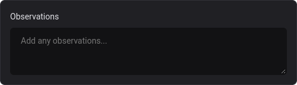

<h1 align="center">Design System</h1>

## Tecnologias

Esse projeto foi desenvolvido com as seguintes tecnologias:

- [ReactJS](https://reactjs.org)
- [TypeScript](https://www.typescriptlang.org/)
- [Stitches](https://stitches.dev)
- [Vite](https://vitejs.dev)
- [Storybook](https://storybook.js.org)

## Components

### Data Display
  - [Avatar](https://brunobecoski.github.io/Ignite-ReactJS-05-Design-System/?path=/story/data-display-avatar--primary)
  
   
  - [Toast](https://brunobecoski.github.io/Ignite-ReactJS-05-Design-System/?path=/story/data-display-toast--primary)
  
      
  - [Tooltip](https://brunobecoski.github.io/Ignite-ReactJS-05-Design-System/?path=/story/data-display-tooltip--primary)
  
  
### Surfaces
  - [Box](https://brunobecoski.github.io/Ignite-ReactJS-05-Design-System/?path=/story/surfaces-box--primary) 
  

### Form
  - [Button](https://brunobecoski.github.io/Ignite-ReactJS-05-Design-System/?path=/story/form-button--primary)
  
    
  - [Checkbox](https://brunobecoski.github.io/Ignite-ReactJS-05-Design-System/?path=/story/form-checkbox--primary)
  

  - [Multi Step](https://brunobecoski.github.io/Ignite-ReactJS-05-Design-System/?path=/story/form-multi-step--primary)
  
  
  - [Text Area](https://brunobecoski.github.io/Ignite-ReactJS-05-Design-System/?path=/story/form-text-area--primary)
  
  
  - [Text Input](https://brunobecoski.github.io/Ignite-ReactJS-05-Design-System/?path=/story/form-text-input--primary)
  
    
### Typography
  - [Heading](https://brunobecoski.github.io/Ignite-ReactJS-05-Design-System/?path=/story/typography-heading--primary)
  
    
  - [Text](https://brunobecoski.github.io/Ignite-ReactJS-05-Design-System/?path=/story/typography-text--primary)
  
